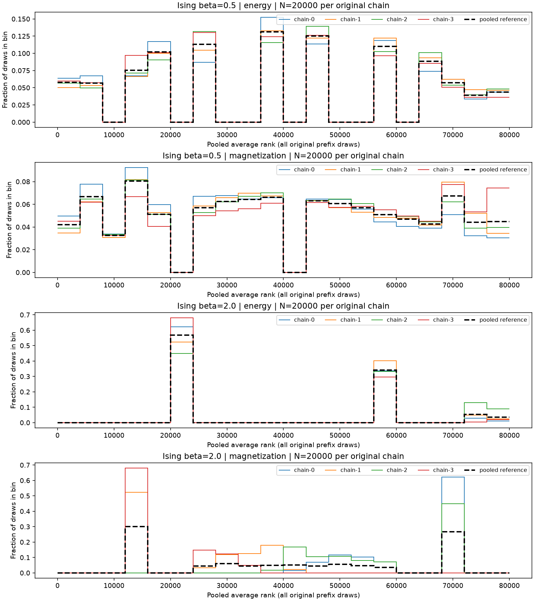
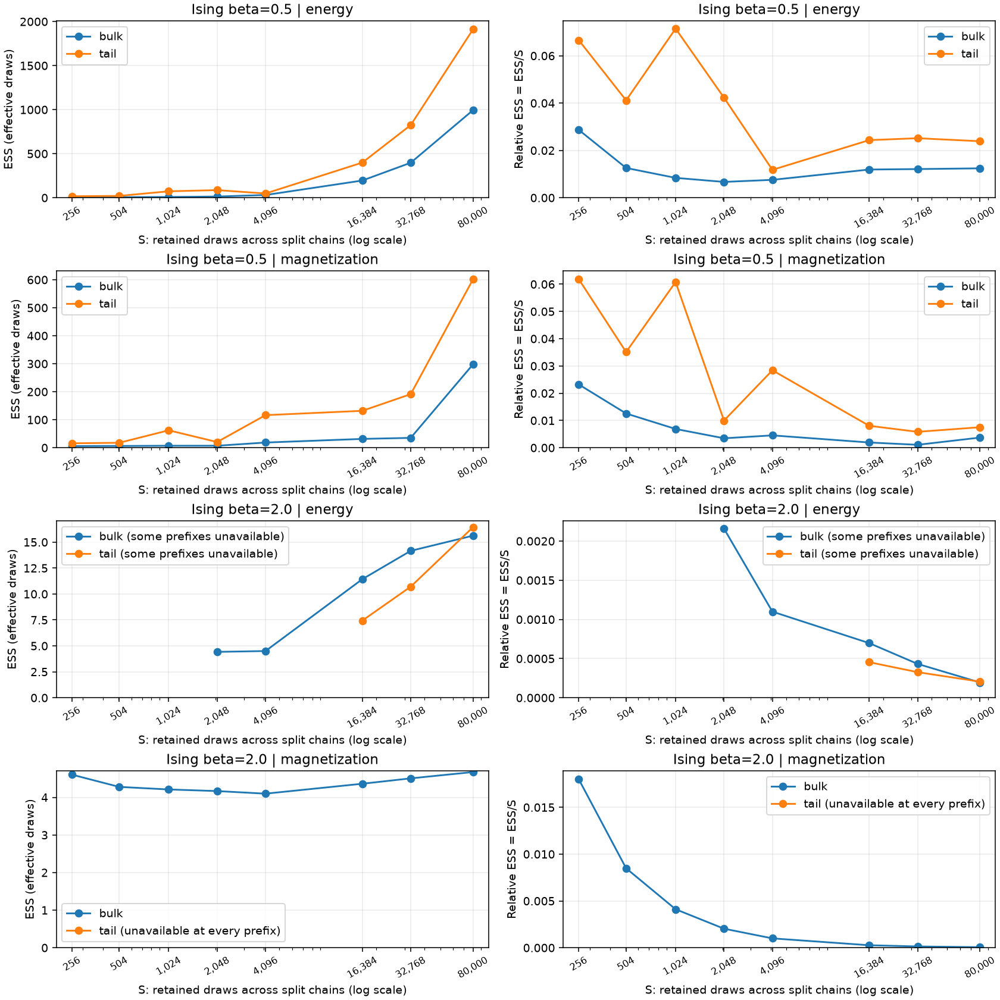

# Analyzing Chains

Use scalar diagnostics to assess mixing, estimate Monte Carlo precision, and compare sampling efficiency.
The library provides autocorrelation, single- and multi-chain effective sample size (ESS),
classical and rank-based R-hat, and mean/quantile Monte Carlo standard errors (MCSE), without optional Cargo features.
Independently initialized chains can run sequentially; parallel execution is not required.

This guide follows **one Ising example throughout**: energy and magnetization from four chains per temperature,
with 5,000 warmup steps and 20,000 production draws per chain.
The baseline and colder runs use the same model and observation code; the figures below come from those exact traces.

For practical guidance, see Martin, Abril-Pla, and Deklerk's **[Exploratory Analysis of Bayesian Models (EABM)][eabm]**,
especially [Chapter 4: MCMC Diagnostics][eabm-diagnostics] on interpreting traces, rank plots, R-hat, ESS, and MCSE.

**Independent numerical checks:** the crate's multi-chain ESS, MCSE, and rank-normalized R-hat methods are checked against [ArviZ 0.22.0][arviz]
using pinned reference fixtures and reproducible generators.
[posterior 1.7.0][posterior] supplies additional combined R-hat references.
The [validation evidence](#validation-evidence) records the comparisons and intentional differences in handling unavailable results.

## Contents

- [Choose the quantity](#choose-the-quantity)
- [Input and estimator contracts](#input-and-estimator-contracts)
- [Follow along with Ising observables](#follow-along-with-ising-observables)
- [Render the Ising figures](#render-the-ising-figures)
- [Original-chain ranks and prefix efficiency](#original-chain-ranks-and-prefix-efficiency)
- [Export and notebook workflow](#export-and-notebook-workflow)
- [Keep unavailable results explicit](#keep-unavailable-results-explicit)
- [Validation evidence](#validation-evidence)

## Choose the quantity

Start with traces and original-chain rank plots, combined rank/folded R-hat, and bulk/tail ESS.
Then estimate MCSE for the specific mean or quantile you intend to report.
[Vehtari et al.][rank-methods] motivate this combination: classical R-hat can miss scale disagreement and heavy-tail problems,
and bulk ESS does not directly measure precision of a raw mean.

| Question | API | Interpretation |
| --- | --- | --- |
| Do original chains explore similar regions? | `PooledRanks::from_chains(&chains)?.chain(index)` | Pooled average ranks in original draw order |
| How correlated are draws at each lag? | `Autocorrelation::estimate(samples, max_lag)?.values()` | ACF from lag zero through the inclusive maximum lag |
| How much information does one chain provide about a mean? | `acf.integrated_time()?.effective_sample_size()` | Single-chain mean ESS, `N / tau` |
| How much mean information do comparable chains provide together? | `EssEstimate::estimate(&chains, EssEstimator::Mean)?` | Raw-scale split ESS, including between-half disagreement |
| How well are the bulk and selected quantiles explored? | `EssEstimator::Bulk`, `EssEstimator::Quantile(p)`, `TailEss::estimate(&chains)?` | Rank-normalized bulk or quantile-indicator ESS; tail ESS is the minimum of both 0.05/0.95 components |
| How precise are the summaries in observable units? | `MeanMcse::estimate(&chains)?`, `QuantileMcse::estimate(&chains, p)?` | Estimated Monte Carlo error of the mean or quantile |
| Do within-half and between-half variations agree? | `SplitRhat::estimate(&chains)?.value()` | Classical split variance ratio |
| Do chains disagree in ranked location or folded deviations? | `RankNormalizedSplitRhat`, `FoldedRankNormalizedSplitRhat` | Rank-based components; folding adds scale sensitivity |
| What is the combined rank-based check? | `CombinedRhat::estimate(&chains)?.value()` | Maximum of both components; `None` if either is unavailable |
| What fraction of retained draws is effective? | `ess.relative()` | ESS divided by retained split count |
| How much effective information was produced per second? | `ess.per_second(timing)?`, `time.effective_sample_size_per_second(elapsed)?` | ESS divided by measured workload wall time |

For a `Trace`, select one observable from one chain with `trace.observable_values(id, "energy")?.copied().collect::<Vec<_>>()`.
Selection borrows the trace, checks the column name, and preserves insertion order.
Use `records_for_chain(id)` to verify step ordering and constant spacing; keep rejected and no-proposal steps.
Keep chains separate: concatenation creates artificial transitions, and summing per-chain ESS omits between-chain disagreement.
ESS is specific to the observable and summary; mean, bulk, and tail ESS are different quantities.

Mean MCSE estimates uncertainty in the sampled mean, in observable units.
It is distinct from target/posterior standard deviation and requires finite population moments and a suitable Markov chain central limit theorem.
A finite result from heavy-tailed data does not establish those assumptions.
Use raw mean ESS in this calculation; substituting bulk ESS changes its meaning.
See the [mean MCSE contract](scientific_basis.md#monte-carlo-standard-errors) and [Stan's explanation][stan-diagnostics].

Quantile MCSE follows [Vehtari et al., Section 4.4][rank-methods], with beta/order-statistic bounds for uncertainty in the estimated quantile.
These bounds describe Monte Carlo error, rather than a target/posterior interval.
Interpretation needs adequate local information; the usual quantile approximation assumes positive continuous density near the quantile.
Tied/discrete observations can leave MCSE unavailable even when indicator ESS is computable.
[Binning](scientific_basis.md#binning-analysis), following [Flyvbjerg and Petersen][blocking], is a separate blocked mean-error method.

For rates, record the measured workload and what its timing includes.
Construct `DiagnosticTiming::try_new(elapsed, original_chain_count, original_draws_per_chain)` and pass `Some(&timing)` to multi-chain rates.
Absent timing, zero duration, or mismatched counts leave the rate unavailable.
Matching counts do not prove trace identity.
Sequential production segments can be summed; parallel chains require their actual concurrent wall time.
Prefixes need their own measurement, and comparisons need matching timing scopes.

## Input and estimator contracts

Discard warmup and finish adaptation before analyzing fixed-kernel production draws.
Preserve temporal order and a fixed recording interval, including rejection and no-proposal self-loops.
Compare the same observable, units, target, cadence, and warmup policy across independently initialized chains.
Separate seeds and finite slices cannot establish independence, stationarity, or mixing.

The integrated-time interpretation uses [Geyer's initial sequence estimators][initial-sequence].
Their justification assumes a stationary reversible chain, finite observable variance, and summable autocorrelations.
Finding a truncation pair in a finite trace does not establish those conditions.
See [autocorrelation](scientific_basis.md#autocorrelation-estimator-contract)
and [ESS assumptions](scientific_basis.md#ess-and-wall-clock-efficiency) for the complete contracts.

| Estimator | Input and arithmetic choices |
| --- | --- |
| ACF and single-chain ESS | At least two finite, varying observations; `max_lag < N`. Biased autocovariances use divisor `N` at every lag. Integrated time requires a nonpositive adjacent pair to truncate its initial monotone sequence. |
| Split R-hat components | At least two equal-length finite chains, each with at least four draws. First/last halves omit an odd middle draw, which is still checked for finiteness. Any constant half makes the affected component unavailable. |
| Multi-chain ESS | Same shape/count minima, with constant individual halves allowed when the estimator remains defined. Bulk ranks use retained draws; quantile cutoffs use all original draws. |
| Mean and quantile MCSE | Mean MCSE uses all-original-draw sample variance and raw mean ESS. Quantile MCSE uses probabilities strictly in `(0,1)`, a linear type-7 point estimate, and beta/order-statistic bounds. |

These count minima make formulas defined; they do not establish statistical reliability.
Classical split R-hat builds on [Gelman and Rubin's multiple-sequence diagnostic][original-rhat],
with the implemented split variance ratio specified by [Stan][stan-diagnostics].
Rank normalization and folding follow [Vehtari et al.][rank-methods].
Folding uses the median of all original draws **before splitting**, including an odd middle draw.
Classical and rank-based R-hat preserve values below one.
See the scientific basis for [classical](scientific_basis.md#classical-split-r-hat), [rank-normalized](scientific_basis.md#rank-normalized-split-r-hat),
and [combined](scientific_basis.md#folded-and-combined-r-hat) conventions.

For `M` original chains of length `N`, multi-chain ESS uses `S = 2 M floor(N/2)` retained draws.
Relative ESS is ESS/S and can exceed one under antithetic sampling.
The pooled estimator regularizes integrated time at `1/log10(S)`; `is_regularized()` reports when this changes the result.
Its finite-lag conventions differ from single-chain ESS.
See [multi-chain ESS and its pinned references](scientific_basis.md#multi-chain-effective-sample-size).

Neither large ESS nor R-hat near one proves convergence or exploration of every mode.
Use dispersed starts, inspect multiple observables and traces, and assess precision for the summaries you need.
All chains can agree while missing the same region of the target distribution.

## Follow along with Ising observables

[`examples/ising_1d.rs`](../examples/ising_1d.rs) is a complete runnable program with the state, target, proposal,
warmup, observation loop, diagnostics, and exports. From the repository root, run:

```bash
just example ising_1d
```

The model has 50 spins `s_i` in `{-1, +1}`, open boundaries, zero external field, and coupling `J = 1`.
The example runs a baseline at inverse temperature `beta = 0.5` and a colder case at `beta = 2`.
Its energy is `H = -J * sum(s_i * s_(i+1))` over the 49 adjacent pairs, with target weight proportional to `exp(-beta * H)`.
Each proposal flips one uniformly selected spin; applying the same flip undoes a rejection.
For statistical-physics Monte Carlo background, see [Landau and Binder](../REFERENCES.md#ref-5).

| Trace column | Observable | Units |
| --- | --- | --- |
| `energy` | Total energy `H`, without division by the spin count | Energy, with `J = 1` |
| `magnetization` | Magnetization per spin `m = sum(s_i) / 50` | Dimensionless, from -1 to +1 |

Four chains run sequentially with seeds 42–45, starting from all-up, all-down, and the two alternating configurations.
At each temperature, each chain discards 5,000 warmup transitions, then records **20,000 production draws**:
80,000 records per temperature, or 160,000 across both runs.
Seeds and starts are reused across temperatures to hold the demonstration settings fixed; the two runs are not independent replicated experiments.
One transition attempts one spin flip; these counts are not sweeps over all 50 spins.
The recording loop retains rejected steps and gives both observables the same cadence:

```rust
let mut recorder = TraceRecorder::new(chain_id, ["energy", "magnetization"])?;
for _ in 0..SAMPLES {
    let step = sampler.step_mut()?;
    let chain = sampler.chain_ref();
    let state = chain.state();
    recorder.record(
        chain,
        TraceStepOutcome::from(&step),
        [target.energy(state), state.magnetization()],
    )?;
}
```

After combining the four traces with `Trace::extend`, select each observable separately while preserving chain boundaries.
The following analysis function shows the public API calls used by the example's `precision_diagnostics` function;
the complete program also reports pooled means and exports results and unavailable reasons to JSON.

```rust
use markov_chain_monte_carlo::{
    ChainId, CombinedRhat, EssEstimate, EssEstimator, MeanMcse, TailEss, Trace, TraceError,
};

fn ising_precision(trace: &Trace, chain_ids: &[ChainId]) -> Result<(), TraceError> {
    for name in ["energy", "magnetization"] {
        let columns: Vec<Vec<f64>> = chain_ids
            .iter()
            .map(|&id| trace.observable_values(id, name).map(|values| values.copied().collect()))
            .collect::<Result<_, _>>()?;
        let chains: Vec<&[f64]> = columns.iter().map(Vec::as_slice).collect();

        match MeanMcse::estimate(&chains) {
            Ok(error) => println!(
                "{name}: mean MCSE={}, mean ESS={}",
                error.value(), error.effective_sample_size().value()
            ),
            Err(error) => println!("{name}: mean precision unavailable: {error}"),
        }
        println!("{name}: bulk ESS={:?}",
            EssEstimate::estimate(&chains, EssEstimator::Bulk).map(EssEstimate::value));
        match TailEss::estimate(&chains) {
            Ok(tail) => println!(
                "{name}: tail ESS={:?}, lower={:?}, upper={:?}",
                tail.value(),
                tail.lower().map(EssEstimate::value),
                tail.upper().map(EssEstimate::value)
            ),
            Err(error) => println!("{name}: tail ESS unavailable: {error}"),
        }
        match CombinedRhat::estimate(&chains) {
            Ok(rhat) => println!(
                "{name}: combined R-hat={:?}, rank={:?}, folded={:?}",
                rhat.value(),
                rhat.rank_normalized().map(|part| part.value()),
                rhat.folded().map(|part| part.value())
            ),
            Err(error) => println!("{name}: R-hat unavailable: {error}"),
        }
    }
    Ok(())
}
```

Call it with the combined production trace and IDs `[ChainId::new(0), ChainId::new(1), ChainId::new(2), ChainId::new(3)]`.
Energy mean MCSE has energy units; magnetization mean MCSE has magnetization-per-spin units.
Bulk/tail ESS measure effective draw counts, and R-hat is dimensionless.
For these even-length inputs, split diagnostics use eight halves of 10,000 draws and retain all 80,000 observations.
Both Ising observables are discrete, so this walkthrough emphasizes means rather than quantile MCSE;
tied quantile bounds and tail/folded degeneracy still require explicit unavailable results.

Inspect `target/ising_1d_trace.csv` for baseline observations and `target/ising_1d_cold_trace.csv` for the colder run.
Both retain step outcomes and ordered energy/magnetization measurements.
The baseline's companion `target/ising_1d_diagnostics.json` contains its scalar results.
The JSON's `chains` and `rhat` sections retain single-chain mean ESS/rates and classical split R-hat;
`multi_chain` adds observable means, mean MCSE, mean/bulk/tail ESS, and combined R-hat with component results.
To plot the exported physical observables, run:

```bash
just notebook-sync
uv run --locked --group dev --group notebook research-repo-tools notebooks execute notebooks/ising_trace_analysis.ipynb
```

The notebook writes trace/ACF figures and single-chain ESS/classical R-hat tables under `target/notebooks/`.
Compare its observable names and counts with the Rust report; the [export workflow](#export-and-notebook-workflow) explains timing and input overrides.

<a name="run-the-complete-workflow"></a>

## Render the Ising figures

From the repository root:

```bash
just diagnostic-plots
```

This command runs [`examples/ising_1d.rs`](../examples/ising_1d.rs) and renders its schema-2 `target/diagnostics.json`.
Its [report helper](../examples/ising_1d/diagnostics.rs) analyzes energy and magnetization at each temperature,
using the same production observations exported to the Ising trace CSVs.
All four chains within a temperature have the same target; temperatures are analyzed separately.
The report includes ACF, single/multi-chain ESS, mean/quantile MCSE, blocked errors, and all R-hat components.
Quantile probabilities are 0.05, 0.5, and 0.95, with unavailable results retained for tied discrete bounds or indicators.
Fixed seeds support reproduction with pinned dependencies; the results illustrate diagnostics and are not a convergence gate.

| Command | Result |
| --- | --- |
| `just diagnostic-plots` | Regenerate Rust exports and render the rank/efficiency notebook |
| `just diagnostic-plots-data` | Regenerate Rust CSV/JSON with build-time source provenance |
| `just example ising_1d` | Run both Ising temperatures and write traces and diagnostic reports |
| `just notebook-check` | Lint and execute both analysis notebooks |
| `just diagnostic-plots-figures` | Regenerate the two tracked rank/ESS figures below |

The Ising example measures sequential production segments, including transitions, observations, recording, and running magnetization sums.
Warmup, diagnostics, and export are excluded; allocations during observation and recording are included.
ESS/second illustrates this timing contract; it varies with build profile and machine and is not benchmark evidence.
The [example validator](../tooling/examples.toml) checks successful demonstration output through `just examples` and `just ci`.

## Original-chain ranks and prefix efficiency

### Read the rank overlays

Every row below contains **four original Ising chains × 20,000 draws = 80,000 observations**, after 5,000 warmup steps per chain.
Pool and sort that row's observable values at its temperature to assign ranks 1–80,000, averaging ranks for exact ties.
Then return each rank to its original chain and bin it using 20 common equal-width bins.
The horizontal axis is rank, with smaller observable values on the left and larger ones on the right.
The vertical axis is the fraction of a chain's 20,000 draws in that bin; a height of 0.10 means 2,000 draws.
This rank histogram does not show temporal order; inspect a trace plot for that.

Blue, orange, green, and red identify original chains 0–3.
The dashed black line bins all 80,000 ranks and divides by 80,000, providing the **pooled bin reference**.
These observables are discrete, so ties make the reference nonflat even when chains agree.
Compare each chain's colored profile with that reference and with the other chains.
The vertical scales differ across rows, so compare shapes within a row rather than raw panel heights.

| Row | Observable and temperature | What to inspect |
| --- | --- | --- |
| Baseline energy | Total energy, `beta = 0.5` | Whether chains cover similar energy levels |
| Baseline magnetization | Magnetization per spin, `beta = 0.5` | Whether chains explore both magnetization signs similarly |
| Cold energy | Total energy, `beta = 2` | Agreement in energy can coexist with poor magnetization exploration |
| Cold magnetization | Magnetization per spin, `beta = 2` | Differences between chains occupying long-lived magnetization regions |



Each tied group receives one average rank, leaving some bins empty.
Similar spikes across chains and the pooled reference can therefore indicate agreement rather than failed mixing.
Inspect both observables: energy is unchanged by reversing all spins, whereas magnetization changes sign.
Energy agreement alone can therefore miss differences in magnetization exploration.
Neither uniform-looking ranks nor agreement with pooled bins proves convergence.
[Vehtari et al., Section 4.5][rank-methods] motivate these rank plots and prefix efficiency curves.

### Read the prefix efficiency curves

Each point below uses the **first `N` draws from each of the four chains**, rather than a new run or one chain's ESS.
The example recomputes ranks, quantile cutoffs, and multi-chain diagnostics from that prefix alone.
The eight prefixes are nested, so their estimates are correlated; connecting lines are visual guides.
Reusing full-run ranks or cutoffs would change the prefix analysis.

Split diagnostics internally use eight halves of `floor(N / 2)` draws each.
The horizontal axis counts retained observations across those halves, `S = 8 * floor(N / 2)`:

| Original draws per chain `N` | Pooled original draws `4N` | Draws per split half | Retained split count `S` |
| --- | --- | --- | --- |
| 64 | 256 | 32 | 256 |
| 127 | 508 | 63 | 504 |
| 256 | 1,024 | 128 | 1,024 |
| 512 | 2,048 | 256 | 2,048 |
| 1,024 | 4,096 | 512 | 4,096 |
| 4,096 | 16,384 | 2,048 | 16,384 |
| 8,192 | 32,768 | 4,096 | 32,768 |
| 20,000 | 80,000 | 10,000 | 80,000 |

At `N = 127`, each original chain's middle draw is omitted from split autocovariances and rank normalization.
The original-chain rank plot still includes it; quantile cutoffs also use all 508 original observations.
Splitting creates analysis halves, not eight independently initialized sampling chains.



Blue is rank-normalized **bulk ESS**; orange is **tail ESS**, the smaller of the 0.05/0.95 indicator ESS components.
Each is a combined estimate from all four original chains for the row's observable.
The left column measures effective draw counts; the right shows `ESS / S`, effective information per retained draw.
These axes do not measure MCSE in observable units or ESS per second.
At the final point, `S = 80,000` for each observable and temperature.
The horizontal scale is logarithmic to keep short prefixes visible alongside the full run.

Full-run values in these fixed-seed figures are rounded below; each row uses 80,000 retained draws.

| Temperature | Observable | Bulk ESS | Tail ESS | Combined R-hat |
| --- | --- | --- | --- | --- |
| Baseline, `beta = 0.5` | Energy | 994 | 1,912 | 1.007 |
| Baseline, `beta = 0.5` | Magnetization per spin | 298 | 602 | 1.007 |
| Cold, `beta = 2` | Energy | 15.6 | 16.4 | 1.182 |
| Cold, `beta = 2` | Magnetization per spin | 4.67 | Unavailable | 2.704 |

For example, baseline energy has `994 / 80,000 = 0.0124` relative bulk ESS, while baseline magnetization has about `0.00372`.
The cold run shows much stronger disagreement and little effective information about magnetization despite its large draw count.
Its orange magnetization curve is absent because the 0.95 sample quantile is the maximum `m = +1`:
every draw satisfies `m <= +1`, so that tail indicator is constant.
This discrete-observable limitation is distinct from the mixing warning in bulk ESS and R-hat.

For stable sampling, collecting more draws should eventually increase ESS roughly in proportion to `S`, while `ESS / S` settles.
Finite estimates can rise or fall between prefixes.
Compare baseline energy with baseline magnetization to see observable-specific sampling efficiency.
Compare each baseline row with its cold counterpart to assess how the same update rule performs at a lower temperature.
Missing points mean unavailable estimates, such as a constant quantile indicator or an observable with no within-half variation; they do not mean zero ESS.
Panel scales differ, and these finite examples provide illustrations rather than pass/fail thresholds.
Only full runs have measured production timing; untimed prefixes leave ESS/second unavailable.

### Use the plot data

`PooledRanks::from_chains(&chains)` returns owned plot data with borrowed `chain(index)` slices in original draw order.
Pair input positions with your application's `ChainId`s.
Ranks are one-based pooled averages for exact ties, including signed zeros.
Constant, single-draw, or unequal-length finite chains are valid plot inputs, although they may be unsuitable for ESS or R-hat.
Empty/nonfinite inputs and unsupported counts return [`PooledRankError`][rank-errors].

[`notebooks/diagnostic_plots.ipynb`](../notebooks/diagnostic_plots.ipynb) renders exported Rust results without recomputing estimators.
It writes rank, efficiency, and trace/ACF figures plus `rank_bins.csv`, `efficiency.csv`, `summary.csv`,
and `blocked_errors.csv` under `target/notebooks/diagnostics/`.
Unavailable results retain status/reason fields, including missing ACF legend entries and blocked-error rows.
Blocked errors preserve each chain's block size, block count, and used draws; the coarsest level is not automatically reliable.

To render a saved report without regenerating data:

```bash
just notebook-sync
MCMC_DIAGNOSTICS_PATH=/path/to/diagnostics.json \
MCMC_NOTEBOOK_OUTPUT_DIR=target/notebooks/saved-diagnostics \
uv run --locked --group dev --group notebook research-repo-tools notebooks execute notebooks/diagnostic_plots.ipynb
```

Explicit input paths never fall back to another report.
`MCMC_NOTEBOOK_OUTPUT_DIR` selects the output directory; `MCMC_REPO_ROOT` controls default paths.
Change the notebook's `rank_prefix` to inspect another exported prefix.
Trace axes use recorded-draw indices and label the positive recording interval.

## Export and notebook workflow

The Ising example writes schema-2 `target/diagnostics.json` with exact draws, ranks, results, and temperature/observable/chain identities.
It retains seeds, starts, Ising parameters, proposal identity, warmup, cadence, original/used counts, RNG/crate versions, and estimator references.
Its CSV columns are `run_id,observable,chain_id,draw,value`.

The named build recipes capture source revision and dirty state; the report embeds the Cargo lockfile and declared Rust baseline.
Retain the source checkout/diff for dirty builds: a version or revision alone cannot reconstruct local edits.
Direct Cargo builds without the provenance environment values report null source provenance.
The plotting notebook copies the exact input JSON and records its SHA-256 and plotting versions in `manifest.json`;
the shared executor also records notebook/environment provenance.

The baseline's schema-1 `target/ising_1d_diagnostics.json` accompanies its CSV trace and identifies estimators, observables, chains, warmup,
recording interval, counts, per-chain seconds, and production timing scope.
Production timing includes sampling and observation/recording and excludes warmup, export, and diagnostics.

[`notebooks/ising_trace_analysis.ipynb`](../notebooks/ising_trace_analysis.ipynb) computes diagnostics from that trace.
It uses companion timing only for matching full production samples.
External traces need an explicit `MCMC_DIAGNOSTICS_PATH` for rates; further warmup removal leaves full-run timing unavailable.
Preserve the source JSON with exported ESS/R-hat tables to retain timing and warmup scope.
This notebook is an additional consumer, rather than an independent numerical oracle.

The example sets parameters in Rust source and replaces generated files under `target/` on reruns.
Console output is a summary; use CSV/JSON for analysis.
The exports are example-owned formats, independent of optional checkpoint `serde` support.
JSON and plotting dependencies are development dependencies; ordinary library use requires neither.

## Keep unavailable results explicit

Preserve status, nullable values, typed errors, and observable/chain context.
Do not replace unavailable ESS with zero, R-hat with one, or a collapsed quantile interval with zero uncertainty.
Display/debug strings in exports are versioned evidence; use Rust variants for failure-specific handling.

| Outcome | Response |
| --- | --- |
| `AutocorrelationError::TruncationNotFound` | Increase the lag budget or collect more draws, then reassess; the current window does not establish truncation |
| Unavailable R-hat component | Retain its reason and original count metadata; a successful component does not replace the missing combined maximum |
| Unavailable tail component | Retain each component; the minimum, relative ESS, and rate require both to succeed |
| Collapsed quantile interval | Retain unavailability; tied order statistics do not establish exactness |
| Missing or mismatched timing | Preserve ESS while leaving ESS/second unavailable |

`CombinedRhat::estimate` returns an error for invalid inputs/counts, otherwise a report with both component results and an optional maximum.
A valid binary/count observable can have constant folded deviations and therefore no combined value.
Whether a structurally constant observable belongs in an application gate remains caller policy.

Exports retain original and retained counts.
When Ising R-hat fails, half lengths and omitted-middle counts are null; original per-chain length is also null for unequal lengths or no chains.
Unavailable quantile MCSE leaves its exported point/interval fields null while preserving the separate indicator ESS result.

See [`AutocorrelationError`][acf-errors], [`SplitRhatError`][rhat-errors], and [`MonteCarloError`][mc-errors] for complete failure contracts,
and [numerical conventions](scientific_basis.md#diagnostics) for count/precision limits.

## Validation evidence

The existing examples and tests cover this workflow; reference agreement and successful rendering answer different validation questions.

| Evidence | Coverage |
| --- | --- |
| [`examples/ising_1d.rs`](../examples/ising_1d.rs), [report helper](../examples/ising_1d/diagnostics.rs) | Complete sampling, observation, and diagnostic workflow at two Ising temperatures |
| [`tests/autocorrelation.rs`](../tests/autocorrelation.rs), [`tests/convergence.rs`](../tests/convergence.rs) | Hand-calculated estimates, analytic AR(1) behavior, drift, separated chains, trace selection, self-loops, and numerical extremes |
| [ACF properties](../tests/proptest_autocorrelation.rs), [R-hat properties](../tests/proptest_convergence.rs) | Exact integer-moment oracles and public-API invariants |
| [`tests/rank_normalized_rhat.rs`](../tests/rank_normalized_rhat.rs), [`tests/combined_rhat.rs`](../tests/combined_rhat.rs) | Pinned ArviZ/posterior comparisons, Cauchy and scale disagreement, folded degeneracy, ties, and odd-length conventions |
| [`tests/ess.rs`](../tests/ess.rs), [ESS properties](../tests/proptest_ess.rs) | Thirteen pinned ArviZ regimes, ESS/MCSE units, timing mismatches, antithetic regularization, and explicit sentinel-policy differences |
| [`tests/pooled_ranks.rs`](../tests/pooled_ranks.rs), [plot fixtures](../tests/fixtures/diagnostic_plots.json) | Original identity/order, odd middles, ties/signed zeros, and independently reranked prefixes |
| [`tests/public_api.rs`](../tests/public_api.rs), API doctests | Public imports, components, ratios/rates, and ownership contracts |
| [`tests/tooling/test_notebooks.py`](../tests/tooling/test_notebooks.py) | Report/count consistency, missing results, cadence labels, matching timing, and artifact consumption |

[ArviZ developers][arviz] supply independent numerical reference implementations for multi-chain ESS/MCSE and rank-normalized R-hat.
The [ArviZ software paper by Kumar et al.][arviz-paper] credits the package underlying these pinned comparisons.
The [Stan posterior contributors][posterior] supply the combined R-hat fixtures.
Pinned versions, exact inputs, tolerances, and intentional policy differences are retained with the fixture generators;
agreement establishes the tested conventions, rather than convergence of an arbitrary chain.

Run the Rust integration tests with `just test-integration`, API examples with `just test-doc`,
and notebook consumer tests with `uv run --locked --group dev pytest -q tests/tooling/test_notebooks.py`.
To reproduce independent references and cross-check a freshly exported report:

```bash
uv run --script tests/fixtures/generate_ess.py
uv run --script tests/fixtures/generate_combined_rhat.py
uv run --script tests/fixtures/generate_diagnostic_plots.py
uv run --script tests/fixtures/generate_diagnostic_plots.py --report target/diagnostics.json
```

These isolated scripts verify retained evidence without rewriting it.
They pin Python 3.13.7, NumPy 2.2.6, SciPy 1.16.2, and ArviZ 0.22.0.
The combined-fixture script cross-checks retained posterior 1.7.0 results using ArviZ with posterior's fold-before-split convention;
it does not rerun the original R oracle.

[acf-errors]: https://docs.rs/markov-chain-monte-carlo/latest/markov_chain_monte_carlo/enum.AutocorrelationError.html
[arviz]: ../REFERENCES.md#ref-19
[arviz-paper]: ../REFERENCES.md#ref-23
[blocking]: ../REFERENCES.md#ref-7
[eabm]: ../REFERENCES.md#ref-24
[eabm-diagnostics]: https://arviz-devs.github.io/EABM/Chapters/MCMC_diagnostics.html
[initial-sequence]: ../REFERENCES.md#ref-8
[mc-errors]: https://docs.rs/markov-chain-monte-carlo/latest/markov_chain_monte_carlo/enum.MonteCarloError.html
[original-rhat]: ../REFERENCES.md#ref-22
[posterior]: ../REFERENCES.md#ref-20
[rank-errors]: https://docs.rs/markov-chain-monte-carlo/latest/markov_chain_monte_carlo/enum.PooledRankError.html
[rank-methods]: ../REFERENCES.md#ref-14
[rhat-errors]: https://docs.rs/markov-chain-monte-carlo/latest/markov_chain_monte_carlo/enum.SplitRhatError.html
[stan-diagnostics]: ../REFERENCES.md#ref-13
